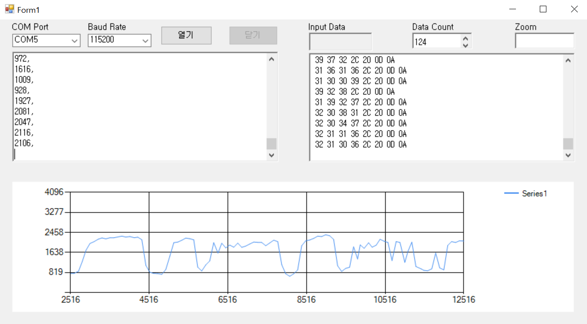
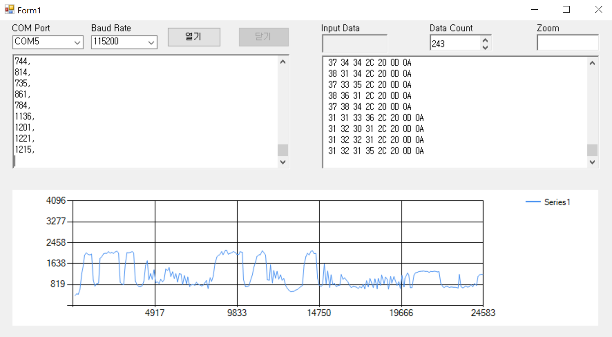

# WinformSerial
vs의 winform으로 c#을 이용해서 serial통신을 만들어보았다.  
첫 c#이라 코드가 엉망이다.  
  
  
  

## 기능
1. 빌드시 PC에 연결된 port 연결
2. 열기 버튼 클릭시 왼쪽 텍스트박스에 수신된 값 표시
3. 수신 된 데이터를 16진수로 변환되어 나타냄
4. 수신된 데이터를 밀리세컨 단위로 그래프로 표시  
-차트 위에서 스크롤 이벤트 할 경우 2000밀리세컨 단위로 줌인, 줌아웃
5. 테스트당시 오로지 수신만 하는 경우기 때문에 inputData를 닫아놨는데 inputData를 통해 송신도 가능
